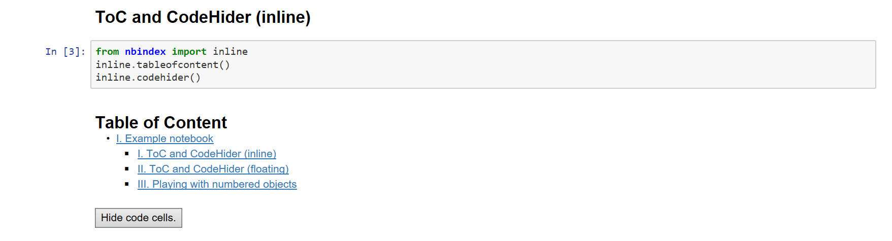
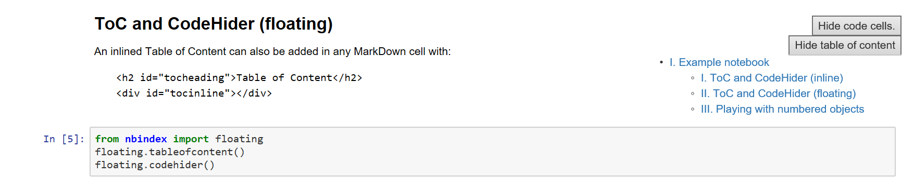

# Index for Jupyter notebooks

`nbindex` is a small package containing several Javascript additions for Jupyter
notebooks like a Table of Content or a Code Hider. These additions are designed
to be executed in a notebook cell so that the added HTML and Javascript functions
will remain hidden in the cell output and can be exported by the regular HTML
export of Jupyter.

## Installation

    pip install nbindex-jupyter

## Usage

### Table of Content and Code Hider

    from nbindex import inline
    inline.tableofcontent()
    inline.codehider()

    from nbindex import floating
    floating.tableofcontent()
    floating.codehider()

### Numbered objects (Figures, ...)

    from nbindex import numbered
    numbered.Figure()
    numbered.Figure("This is a nice Figure.")
    numbered.object("Figure")

